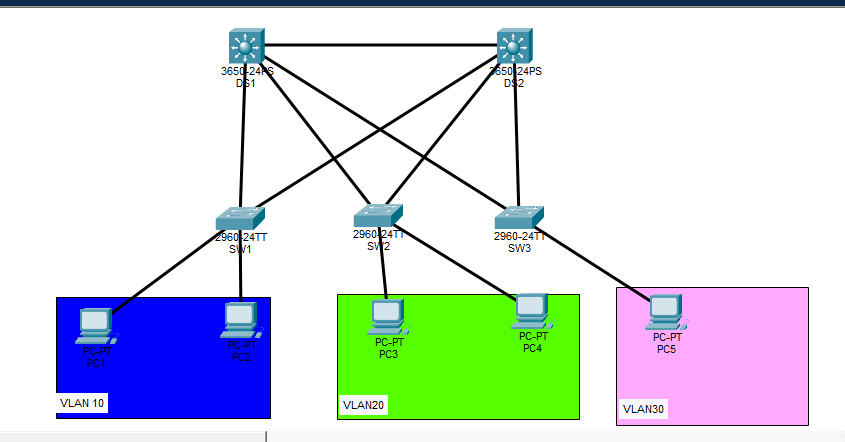

# Collapsed Core Network Architecture Lab

## Overview
This project demonstrates a two-tier enterprise network architecture using a collapsed core design. The topology includes redundant Layer 3 distribution switches and Layer 2 access switches.

Technologies used:
- VLAN segmentation
- Inter-VLAN routing
- HSRP gateway redundancy
- OSPF dynamic routing
- 802.1Q trunking
- Cisco Packet Tracer

## Topology
The network contains:
- 2 Cisco 3650 Layer 3 switches (CORE/DIST)
- 3 Cisco 2960 Layer 2 access switches
- Sales VLAN (10)
- HR VLAN (20)
- Server VLAN (30)

## VLAN Design

| VLAN| Department | Network     |
|-----|------------|-------------|
|10   |Sales       |10.10.10.0/24|
|20   |HR          |10.10.20.0/24|
|30   |Servers     |10.10.30.0/24|

## Redundancy
HSRP is configured to provide gateway redundancy.

Virtual Gateways:
VLAN10 → 10.10.10.1  
VLAN20 → 10.10.20.1  
VLAN30 → 10.10.30.1  

## Routing
OSPF Area 0 is used between the distribution switches.

## Testing
Successful connectivity tests:

- PC1 → PC3 (Inter-VLAN routing)
- PC1 → Server-PC
- HSRP failover test
- Traceroute verification

## Lab File
The Packet Tracer file is included in the repository.
## Network Topology

 

